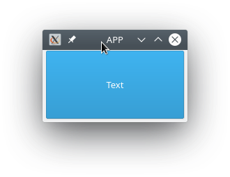
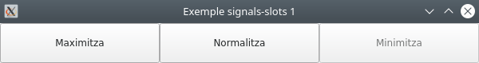

- [Qt i PySide](#qt-i-pyside)
  - [Versions de PySide](#versions-de-pyside)
  - [Instal·lació de PySide6](#installació-de-pyside6)
  - [Comprovem la Instal·lació](#comprovem-la-installació)
- [Primera aplicació amb PySide6 - *Hola món!*](#primera-aplicació-amb-pyside6---hola-món)
  - [Exemple: Hola món! amb PySide6](#exemple-hola-món-amb-pyside6)
  - [Què és una finestra?](#què-és-una-finestra)
  - [Què és el bucle d’esdeveniments (event loop)?](#què-és-el-bucle-desdeveniments-event-loop)
- [QMainWindow](#qmainwindow)
    - [Activitat 1](#activitat-1)
    - [Activitat 2](#activitat-2)
- [Assignem tamany a les finestres i els components](#assignem-tamany-a-les-finestres-i-els-components)
    - [Activitat 3 (entregable)](#activitat-3-entregable)
- [Senyals i ranures (signal & slots)](#senyals-i-ranures-signal--slots)
  - [Exemple: Signals-Slots 1](#exemple-signals-slots-1)
    - [Activitat 4 (entregable)](#activitat-4-entregable)
  - [Encadenaments de senyals](#encadenaments-de-senyals)
  - [Connectem components entre si](#connectem-components-entre-si)
  - [Senyals definits per l'usuari](#senyals-definits-per-lusuari)
  - [Modifiquem la informació emesa pels senyals](#modifiquem-la-informació-emesa-pels-senyals)
    - [Activitat 5](#activitat-5)
- [Esdeveniments](#esdeveniments)

## Qt i PySide

**PySide** és la unió de Python amb el conjunt d'eines per a desenvolupament d'interfícies gràfiques d'usuari multiplataforma Qt, desenvolupat per *The Qt Company*, com a part del projecte [*Qt for Python*](https://doc.qt.io/qtforpython/). És una de les alternatives al paquet de biblioteca estàndard Tkinter. Igual que Qt, PySide és programari lliure. PySide és compatible amb Linux/X11, macOS i Microsoft Windows.

Tot i que hi ha documentació específica de PySide disponible, també podem **utilitzar la documentació de Qt**, tenint en compte que s'haurà de traduir la sintaxi d'objectes i mètodes per adaptar-ho a Python.

### Versions de PySide

Hi ha hagut tres versions principals de PySide:

- PySide és compatible amb Qt 4
- PySide2 és compatible amb Qt 5
- PySide6 és compatible amb Qt 6

La versió 1 de PySide va ser llançada l'agost de 2009 baix llicència LGPL per Nokia, aleshores propietaria de Qt, després de no arribar a un acord amb els desenvolupadors de PyQt, Riverbank Computing, per canviar els seus termes de llicència per incloure LGPL com a llicència alternativa. Va donar suport a Qt 4 sota els sistemes operatius Linux/X11, Mac OS X, Microsoft Windows, Maemo i MeeGo, mentre que la comunitat PySide va afegir suport per a Android.

Christian Tismer va iniciar PySide2 per portar PySide de Qt 4 a Qt 5 el 2015. Aleshores, el projecte es va incorporar al projecte Qt.Va ser llançat el desembre de 2018.

PySide6 es va llançar el desembre de 2020. Va afegir suport per a Qt 6 i va eliminar el suport per a totes les versions de Python anteriors a la 3.6.

El projecte va començar utilitzant Boost.Python de les biblioteques de Boost C++ per a enllaçar el codi Python amb les crides C++, llenguatge sobre el que està contruït Qt. Més tard va crear el seu propi generador d'enllaç anomenat Shiboken, per reduir la mida dels executables i l'ús de memòria.

Nosaltres farem ús de PySide6 durant el present curs.

### Instal·lació de PySide6

Sempre que desenvolupem, hauriem de fer-ho en un entorn virtual. Recordeu que per crear-lo i activar-lo, utilitzem:

```py
python3 -m venv .venv
source .venv/bin/activate #Per a Linux i macOS

env\Scripts\activate.bat #Per a Windows
```

Per a instal·lar PySide6 utilitzem **pip**:

```bash
pip install pyside6
```


### Comprovem la Instal·lació

Una vegada instal·lat i amb l'entorn virtual activat, podem executar el següent codi per comprovar que tot funciona.

```py
import PySide6.QtCore

# Prints PySide6 version
print(PySide6.__version__)

# Prints the Qt version used to compile PySide6
print(PySide6.QtCore.__version__)
```

## Primera aplicació amb PySide6 - *Hola món!*

### Exemple: Hola món! amb PySide6

```py
from PySide6 import QtWidgets, QtCore

# Sols si necessitem arguments importem sys
import sys


if __name__ == "__main__":
    # Necessitem una instància (i sols una) de QApplication per cada aplicació.
    # Li passem sys.argv per a permetre arguments des de la línia de comandaments
    # Si no anem a passar arguments podem utilitzar QApplication([])
    app = QtWidgets.QApplication(sys.argv)

    # Creem un QLabel amb el text Hola món! i aliniament al centre.
    label = QtWidgets.QLabel("Hola món!", alignment=QtCore.Qt.AlignCenter)
    # Redimensionem el QLabel
    label.resize(800, 600)
    #Fem visible el label IMPORTANT!!!!! Els components estan ocults per defecte.
    label.show()

    # Iniciem el bucle d’esdeveniments.
    sys.exit(app.exec())
```

> Si rebeu l'error *libOpenGL.so.0: cannot open shared object file: No such file or directory*, heu d'instal·lar la llibreria *libopengl0*.
> 
>  `sudo apt install libopengl0 -y`

Baixeu el codi [d'ací](resources/code/PySide6/hello.py)

### Què és una finestra?

- Conté la interfície de l’usuari
- Cada aplicació en necessita almenys una, però en pot tindre més
- L’aplicació, per defecte, acabarà en tancar l’última d’elles


### Què és el bucle d’esdeveniments (event loop)?

Ja hem vist que cada aplicació necessita un i sols un objecte QApplication. 

Aquest objecte gestiona els esdeveniments. Cada una de les interaccions de l’usuari amb la interfície, per exemple, un clic de ratolí sobre un element, genera un esdeveniment. 

L’esdeveniment es col·loca a la cola d’esdeveniments per ser gestionat (**event queue**).

Al bucle d'esdeveniments (**event loop**), la cua es comprova a cada iteració i si es troba un esdeveniment en espera, l'esdeveniment i el control es passen al gestor de l’esdeveniment (**event handler**).

El gestor d'esdeveniments s'ocupa de l'esdeveniment i després passa de nou el control al bucle d'esdeveniments per esperar més esdeveniments. 

Només hi ha un bucle d'esdeveniments per aplicació.

## QMainWindow
Es tracta d’un component pre-definit que proporciona moltes funcions estàndard de les finestres que fareu servir les vostres aplicacions, com poden ser les barres d'eines, els menús, la barra d'estat, els components que es poden acoblar, etc. Veurem aquestes funcions avançades més endavant, però de moment anem a fer ús d’ella a la nostra aplicació.

#### Activitat 1
Anem a crear la nostra primera aplicació.

1. Has de definir una classe MainWindow, que herede de QmainWindow.
2. Amb el mètode setWindowTitle() posa-li títol a l’aplicació «La meua aplicació». 
3. Amb QPushButton(), crea un botó amb el text, «Aceptar».
4. Afig el botó a la part central de la finestra amb setCentralWidget(«component»).
5. Recorda mostrar la finestra i iniciar el bucle d’esdeveniments.


#### Activitat 2
Modifica el codi de l’anterior activitat per a que es puga passar per línia de comandaments el títol i el text del botó.

```py
python3 activitat2.2.py "APP" "Text"
```


## Assignem tamany a les finestres i els components

Amb la funcions **.setFixedSize(amplada, altura)** assignem una mida fixa al component sobre el que l’apliquem. 

Amb **.setMinimumSize(amplada, altura)** i **setMaximumSize(amplada, altura)**, assignem les mides màximes i mínimes, de forma que ni redimensionant amb el ratolí ni amb els botons de maximitzar i minimitzar tindrem la possibilitat d’establir unes dimensions menors o majors de les establides.

```py
import sys

from PySide6.QtWidgets import QApplication, QMainWindow, QPushButton

class MainWindow(QMainWindow):
    def __init__(self, title="Title", button_text="Text", fixed=False):
        super().__init__()
        self.setWindowTitle(title)

        self.button = QPushButton(button_text)

        self.setCentralWidget(self.button)

        #self.setFixedSize(400,600)
        self.button.setMaximumSize(100,25)
        self.setMaximumSize(400,400)
        self.setMinimumSize(200,200)

        self.button.show()
        self.show()

app = QApplication(sys.argv)

window = MainWindow()

app.exec()

```
Baixa el codi punxant el següent [enllaç](resources/code/PySide6/main_window.py)

#### Activitat 3 (entregable)

Basant-nos en el codi de l'activitat 2, anem a fer una gestió més pràctica i real dels paràmetres d'entrada de l'script. Este és l'aspecte que tindrà l'ajuda de l'execució de l'script. 

```bash
usage: finestra3_args.py [-h] [-t TITLE] [-b BUTTON_TEXT] [-f] [-s SIZE SIZE]

optional arguments:
  -h, --help            show this help message and exit
  -t TITLE, --title TITLE
                        Title of application
  -b BUTTON_TEXT, --button-text BUTTON_TEXT
                        Button text
  -f, --fixed-size      Window fixed size
  -s SIZE SIZE, --size SIZE SIZE
                        Size of windows
```

Per a fer tota aquesta gestió, busca una llibreria de python que t'ajude.

## Senyals i ranures (signal & slots)

En l’anterior aplicació hem inclòs un botó, però que no executa ninguna acció al fer clic sobre ell. Necessitem connectar les accions a alguna funcionalitat. En Qt, açò s’aconseguix gràcies a les senyals i les ranures.

Una **senyal** és una notificació emesa pels components quan es produeix un esdeveniment. 

Una **ranura** és el nom que Qt dona als rebedors de senyals. En Python, qualsevol funció pot ser una ranura, simplement connectant-li una senyal. 

### Exemple: Signals-Slots 1

```py
from PySide6.QtWidgets import QApplication, QMainWindow, QPushButton
from PySide6.QtCore import QSize

class MainWindow(QMainWindow):
    def __init__(self):
        QMainWindow.__init__(self)

        self.setFixedSize(QSize(300, 300))
        self.setWindowTitle("Exemple signals-slots 1")

        pybutton = QPushButton('Clic', self)
        
        #Connectem la senyal clicked a la ranura button_pressed
        pybutton.clicked.connect(self.button_pressed) 

        pybutton.resize(100, 100)
        pybutton.move(100, 100)

    def button_pressed(self):
        '''
            S'executaà al rebre la notificació de que s'ha apretat el botó:
            - Observeu que la consola imprimirà "Clic rebut!" al fer clic al botó
        '''
        print('Clic rebut!')

if __name__ == "__main__":
    app = QApplication([])
    mainWin = MainWindow()
    mainWin.show()
    app.exec()
```

Pots baixar el codi [ací](resources/code/PySide6/signals_slots1.py)

> En l'anterior codi, a més de connectar la senyal a l'slot, hem utilitzat les funcions resize i move per a assignar el tamany i situar un component.  
> Consulta la documentació per obtindre [més informació sobre les senyals de QPushButton](https://doc.qt.io/qt-6/qpushbutton.html).

#### Activitat 4 (entregable)

Fes una aplicació amb tres botons. Inicialment, l'aplicació ocuparà el tamany normalitzat i els botons estaran centrats, tant verticalment com horitzontalment en tot moment:
- Inicialment l'aplicació es mostrarà centrada sobre la pantalla amb el tamany normalitzat.
- Al fer clic al botó de l'esquerra *Maximitza*, l'aplicació passarà a ocupar el tamany màxim definit.
- Al fer clic al botó de la dreta *Minimitza*, l'aplicació passarà a ocupar el tamany mínim definit.
- Al fer clic al botó central *Normalitza*, l'aplicació passarà a ocupar de nou el tamany normalitzat.
- En cada cas, els botons es deshabilitzaran segons corresponga. És a dir, en tamany normalitzat, el botó corresponent a normalitzar el tamany estarà deshabilitat i la restat habilitats. Per a la resta de tamanys, aplicarem el mateix criteri.
- El tamanys normal, màxim i mínim de finestra, així com els tamanys de botó estaran definits a un arxiu config.py
- El tamany mínim mai podrà ser inferior a la suma dels tamanys de botó.
- El *title* de l'aplicació mostrarà en cada moment en quin estat es troba *Normalitzat, Maximitzat o Minimitzat* 




### Encadenaments de senyals

Fixa't en l'exemple següent:

```py
import sys
from PySide6.QtCore import Qt
from PySide6.QtWidgets import QApplication, QMainWindow, QPushButton

class MainWindow(QMainWindow):
    def __init__(self):
        super().__init__()

        self.setWindowTitle("My App")

        button = QPushButton("Press Me!")
        button.setCheckable(True)
        button.clicked.connect(self.the_button_was_clicked)
        button.clicked.connect(self.the_button_was_toggled)

        self.windowTitleChanged.connect(self.the_window_title_changed)

        # Set the central widget of the Window.
        self.setCentralWidget(button)

    def the_button_was_clicked(self):
        if self.windowTitle() == "La meua aplicació":
            self.setWindowTitle("My App")
        else:
            self.setWindowTitle("La meua aplicació")

    def the_button_was_toggled(self):
        print("Clic rebut!")

    def the_window_title_changed(self, window_title):
        print("Window title changed: %s" % window_title)
 

app = QApplication(sys.argv)
window = MainWindow()
window.show()
app.exec()
```

Pots baixar el codi [ací](resources/code/PySide6/signals_slots2.py)

Treballant amb senyals i ranures hem de tindre en compte:
- Un únic senyal pot estar connectat a diverses ranures -> Clic desencadena l'execució de *the_button_was_toggled* i *the_button_was_clicked*.
- Les ranures poden rebre arguments -> La ranura *the_window_title_changed* rep *window_title* com a argument.
- Un únic esdeveniments pot desencadenar l'emissió de diverses senyals connectades entre elles a través d'una ranura -> Al fer clic es llança l'execució de *the_button_was_clicked*, que a la vegada desencadena l'esdeveniment *windowTitleChanged*.

### Connectem components entre si

No sempre necessitem definir una funció per gestionar un esdeveniment, podem connectar components entre si per fer-ho:

```py
import sys
from PySide6.QtWidgets import QApplication, QMainWindow, QLabel, QLineEdit, QVBoxLayout, QWidget


class MainWindow(QMainWindow):
    def __init__(self):
        super().__init__()

        self.setWindowTitle("My App")

        container = QWidget()
        container.setFixedSize(240,100)

        self.label = QLabel(container)
        self.label.setFixedSize(200,20)
        self.label.move(20, 20)

        self.input = QLineEdit(container)
        self.input.setFixedSize(200,20)
        self.input.move(20, 60)
        self.input.textChanged.connect(self.label.setText)

        self.setCentralWidget(container)

app = QApplication(sys.argv)

window = MainWindow()
window.show()

app.exec()
```

Quan canviem el text del *LineEdit*, el senyal *textChanged* envia el text a la ranura a la qual està connectada, en aquest cas és la funció *setText* del *Label*, canviant així el seu text.

### Senyals definits per l'usuari

Fins ara hem utilitzat els senyals predefinits pels components Qt. Definirem ara els nostres propis senyals. Això ens ajudarà a desacoblar (independitzar, fer que no depenguen unes de altres) les diferents part del programa. A més, ens permetrà fer la nostra aplicació *responsiva*, en compte de tindre un gran mètode *update*, podem partir el treball entre múltiples ranures i llançar-les amb una sola senyal.

Utilitzarem la classe **Signal** amb els tipus que ens interesse:

```py
import sys

from PySide6.QtCore import Qt, Signal
from PySide6.QtWidgets import QApplication, QMainWindow

class MainWindow(QMainWindow):
    message = Signal(str)
    value = Signal(int, str, int)
    another = Signal(list)
    onemore = Signal(dict)
    anything = Signal(object)

    def __init__(self):
        super().__init__()
        self.message.connect(self.custom_slot)
        self.value.connect(self.custom_slot)
        self.another.connect(self.custom_slot)
        self.onemore.connect(self.custom_slot)
        self.anything.connect(self.custom_slot)
        
        self.message.emit("my message")
        self.value.emit(23, "abc", 1)
        self.another.emit([1, 2, 3, 4, 5])
        self.onemore.emit({"a": 2, "b": 7})
        self.anything.emit(1223)

    def custom_slot(self, a):
        print(a)

app = QApplication(sys.argv)
window = MainWindow()
window.show()
app.exec()
```

Podeu baixar el codi [ací](resources/code/PySide6/custom_signals.py)

Com podeu observar, utilitzem el mètode *emit* per a llançar el senyal, que és capaç de transmetre informació de qualsevol tipus, però no és una bona idea que les ranures reben qualsevol tipus, ja que s'hauria de gestionar a la funció, cosa que la complicaria molt.

> Pots crear senyals en qualsevol subclasse de *QObject*, inclòs components, finestres i dialegs.

### Modifiquem la informació emesa pels senyals

Ja hem vist que els senyals poden emetre informació a les ranures. Però els senyals predefinits, sols envien dades que s'ha definit que envien en el seu disseny. Per exemple, *QPushButton.clicked* sols envia el valor de *checked* després de produir-se l'esdeveniment. 

> Per a botons no seleccionable, *setCheckable(False)*, sempre enviarà el valor *False*.

Per solucionar este problema podem *interceptar el senyal* i modificar les dades:

```py
import sys

from PySide6.QtCore import Qt
from PySide6.QtWidgets import QApplication, QMainWindow, QPushButton

class MainWindow(QMainWindow):
    def __init__(self):
        super().__init__()
        btn = QPushButton("Press me")
        btn.setCheckable(True)
        btn.clicked.connect(lambda checked: self.button_clicked(checked, btn))
        self.setCentralWidget(btn)

    def button_clicked(self, checked, btn):
        print(btn, checked)

app = QApplication(sys.argv)
window = MainWindow()
window.show()
app.exec()
```

Pots baixar el codi [ací](resources/code/PySide6/signals_slots3.py)

En aquest cas, el senyal *clicked* emetrà l'estat de *checked*. La funció lambda intercepta el senyal i afegeix la informació de l'objecte *btn*.

#### Activitat 5

Fes una aplicació que tinga un botó. Al fer clic sobre ell, s'executarà una funció que rebrà l'estat del botó. A més, emetrà un nou senyal connectat a una altra funció, que rebrà l'estat del senyal i un número aleatori. Al rebre la nova funció el senyal, imprimirà per pantalla els valors del l'estat del botó i el número aleatori.

## Esdeveniments

Cada interacció que l'usuari té amb una aplicació Qt és un esdeveniment. Hi ha molts tipus d'esdeveniments. Cada esdeveniment és un objecte que empaqueta informació sobre la interacció que l'ha produït. Els esdeveniments es passen a controladors d'esdeveniments (*event handler*) específics del component on s'ha produït la interacció.

Podem definir gestors d'esdeveniments personalitzats, modificant la manera com els vostres components responen a aquests esdeveniments. Els controladors d'esdeveniments es defineixen com qualsevol altre mètode, però el nom és específic per al tipus d'esdeveniment que gestionen.

Un dels principals esdeveniments que reben els components és el QMouseEvent. Els esdeveniments QMouseEvent es produixen en moure i clicar el ratolí sobre un component. Els següents gestors d'esdeveniments estan disponibles per gestionar els esdeveniments del ratolí:

| Gestor d'esdeveniment |  Tipus d'esdeveniment  |
| :-------------------: | :--------------------: |
|    mouseMoveEvent     |   Moviment de ratolí   |
|    mousePressEvent    | Botó del ratolí premut |
|   mouseReleaseEvent   | Botó de ratolí soltat  |
| mouseDoubleClickEvent |  Doble clic detectat   |

Per exemple, fer clic en un component provocarà que s'envie un QMouseEvent al gestor d'esdeveniments *.mousePressEvent* del component. Aquest controlador pot utilitzar l'objecte d'esdeveniment per recollir informació sobre què ha passat, com ara què va desencadenar l'esdeveniment i on concretament es va produir.

Podeu interceptar esdeveniments heretant i anul·lant el mètode del controlador a la classe derivada. Podeu triar filtrar, modificar o ignorar esdeveniments, passant-los al controlador normal de l'esdeveniment cridant a la funció de classe pare amb mètode super(). 

Veiem açò amb una finestra principal. 

> En cada cas, *e* rebrà l'esdeveniment produït.

```py
import sys

from PySide6.QtCore import Qt
from PySide6.QtWidgets import QApplication, QLabel, QMainWindow, QTextEdit


class MainWindow(QMainWindow):
    def __init__(self):
        super().__init__()
        self.label = QLabel("Click in this window")
        self.setCentralWidget(self.label)

    def mouseMoveEvent(self, e):
        self.label.setText("mouseMoveEvent")

    def mousePressEvent(self, e):
        self.label.setText("mousePressEvent")

    def mouseReleaseEvent(self, e):
        self.label.setText("mouseReleaseEvent")

    def mouseDoubleClickEvent(self, e):
        self.label.setText("mouseDoubleClickEvent")


app = QApplication(sys.argv)

window = MainWindow()
window.show()

app.exec()
```

> Observeu que els esdeveniments de moviment del ratolí només es registren quan teniu el botó premut. Podeu canviar-ho afegint un atribut al widget central i cridant ade la finestra.  
> `self.centralWidget().setAttribute(Qt.WA_TransparentForMouseEvents)` 
> `self.setMouseTracking(False)`
> També podeu notar que els esdeveniments de clic i de doble clic es desencadenen quan es prem el botó. Només l'esdeveniment de soltar es dispara quan es deixa de prémer.

