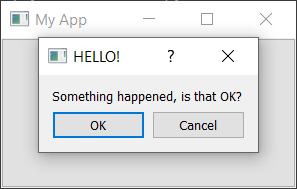

# Dialegs i alertes

## Dialegs 

Els diàlegs són components de la GUI útils que ens permeten comunicar-nos amb l'usuari (d'aquí el seu nom). S'utilitzen habitualment per obrir/gurdar fitxers, configuració, preferències o per a funcions que no encaixen a la interfície principal de l'aplicació. Són xicotetes finestres modals (o de bloqueig) que se situen davant de l'aplicació principal fins que es descarten. Qt ofereix una sèrie de diàlegs "especials" per als casos d'ús més habituals, cosa que ens permet oferir una experiència d'usuari nativa.

A Qt els quadres de diàleg són gestionats per la classe QDialog. Per crear un quadre de diàleg nou, simplement creem un nou objecte de tipus QDialog passant un altre widget, per exemple QMainWindow, com a pare.

Creem el nostre propi QDialog. Començarem amb una aplicació simple:

```py hl_lines="19-21"
import sys

from PySide6.QtWidgets import QApplication, QDialog, QMainWindow, QPushButton


class MainWindow(QMainWindow):
    def __init__(self):
        super().__init__()

        self.setWindowTitle("My App")

        button = QPushButton("Press me for a dialog!")
        button.clicked.connect(self.button_clicked)
        self.setCentralWidget(button)

    def button_clicked(self, s):
        print("click", s)

        dlg = QDialog(self)
        dlg.setWindowTitle("HELLO!")
        dlg.exec()


app = QApplication(sys.argv)

window = MainWindow()
window.show()

app.exec() 
```

A la ranura *button_clicked* creem la instància de diàleg, passant la nostra instància QMainWindow com a pare. Això farà que el diàleg siga una finestra modal de QMainWindow. Això significa que el diàleg bloquejarà completament la interacció amb la finestra principal.

Una vegada hem creat el diàleg, l'iniciem amb *.exec()* - igual que vam fer amb QApplication per crear el bucle d'esdeveniments principal de la nostra aplicació. Això no és una coincidència: quan executeu el QDialog es crea un bucle d'esdeveniments completament nou, específic per al diàleg.

> El QDialog bloqueja completament l'execució de l'aplicació. No inicieu cap diàleg i espereu que passe res més en qualsevol altre lloc de la vostra aplicació. Més endavant veurem com pots utilitzar fils i processos per esquivar aquest problema.

Afegim els botons `D'acord` i `Cancel·la` per permetre a l'usuari acceptar o rebutjar el modal.

Per personalitzar el QDialog podem heredar d'ell.

```py
from PySide6.QtWidgets import QDialog, QDialogButtonBox, QVBoxLayout, QLabel

class CustomDialog(QDialog):
    def __init__(self, parent=None):
        super().__init__(parent)

        self.setWindowTitle("HELLO!")

        QBtn = QDialogButtonBox.Ok | QDialogButtonBox.Cancel

        self.buttonBox = QDialogButtonBox(QBtn)
        self.buttonBox.accepted.connect(self.accept)
        self.buttonBox.rejected.connect(self.reject)

        self.layout = QVBoxLayout()
        message = QLabel("Something happened, is that OK?")
        self.layout.addWidget(message)
        self.layout.addWidget(self.buttonBox)
        self.setLayout(self.layout)
```

> Podeu optar per utilitzar un QButton estàndard en un disseny, però l'enfocament descrit ací garanteix que el vostre diàleg respecta els estàndards de l'escriptori amfitrió (d'acord a l'esquerra o a la dreta, per exemple). Jugar amb aquests comportaments pot ser increïblement molest per als usuaris, així que és recomanable consultar la documentació i seguir les guies d'estil de cada plataforma.

El primer pas per crear un quadre de botons de diàleg és definir els botons que es volen mostrar, utilitzant els atributs de QDialogButtonBox. La llista completa de botons disponibles està a continuació:

- QDialogButtonBox.Ok
- QDialogButtonBox.Open
- QDialogButtonBox.Save
- QDialogButtonBox.Cancel
- QDialogButtonBox.Close
- QDialogButtonBox.Discard
- QDialogButtonBox.Apply
- QDialogButtonBox.Reset
- QDialogButtonBox.RestoreDefaults
- QDialogButtonBox.Help
- QDialogButtonBox.SaveAll
- QDialogButtonBox.Yes
- QDialogButtonBox.YesToAll
- QDialogButtonBox.No
- QDialogButtonBox.Abort
- QDialogButtonBox.Retry
- QDialogButtonBox.Ignore
- QDialogButtonBox.NoButton

Aquests haurien de ser suficients per crear qualsevol quadre de diàleg. Podeu construir una línia de diversos botons posant-los junts amb el símbol `|`. Qt ho gestionarà, segons els estàndards de la plataforma. Per exemple, per mostrar un botó OK i Cancel·la hem utilitzat:

```py
buttons = QDialogButtonBox.Ok | QDialogButtonBox.Cancel
```

La variable *buttons* ara conté un valor enter que representa aquests dos botons. A continuació, hem de crear la instància QDialogButtonBox i la passem com a primer paràmetre.

Perquè els botons tinguen algun efecte, heu de connectar els senyals QDialogButtonBox correctes a les ranures del diàleg. En el nostre cas, hem connectat els senyals *accepted* i *rejected* del QDialogButtonBox als controladors de *accept* i *reject* de la nostra subclasse de QDialog.

Finalment, per fer que el *QDialogButtonBox* aparega al nostre quadre de diàleg hem d'afegir-lo al diàleg.

Finalment, iniciem el *CustomDialog* a la nostra ranura *MainWindow.button_clicked*.

```py
import sys

from PySide6.QtWidgets import QApplication, QDialog, QMainWindow, QPushButton

import customdialog1


class MainWindow(QMainWindow):
    def __init__(self):
        super().__init__()

        self.setWindowTitle("My App")

        button = QPushButton("Press me for a dialog!")
        button.clicked.connect(self.button_clicked)
        self.setCentralWidget(button)

    def button_clicked(self, s):
        # print("click", s)

        dlg = customdialog1.CustomDialog(self)
        if dlg.exec():
            print("Success!")
        else:
            print("Cancel!")


app = QApplication(sys.argv)

window = MainWindow()
window.show()

app.exec()
```



## Diàlegs amb missatges simples (QMessageBox)

Hi ha molts diàlegs que segueixen el patró senzill que acabem de veure: un missatge amb botons amb els quals podeu acceptar o cancel·lar el diàleg. Tot i que podeu construir aquests diàlegs vosaltres mateixos, Qt també proporciona una classe de diàleg de missatge integrada anomenada QMessageBox. Això es pot utilitzar per crear diàlegs d'informació, avisos o preguntes.

L'exemple següent crea un QMessageBox senzill i el mostra.

```py
import sys

from PySide6.QtWidgets import QApplication, QDialog, QMainWindow, QMessageBox, QPushButton


class MainWindow(QMainWindow):
    def __init__(self):
        super().__init__()

        self.setWindowTitle("My App")

        button = QPushButton("Press me for a dialog!")
        button.clicked.connect(self.button_clicked)
        self.setCentralWidget(button)

    def button_clicked(self, s):
        dlg = QMessageBox(self)
        dlg.setWindowTitle("I have a question!")
        dlg.setText("This is a simple dialog")
        button = dlg.exec_()

        if button == QMessageBox.Ok:
            print("OK!")


app = QApplication(sys.argv)

window = MainWindow()
window.show()
```

Igual que amb el quadre de botons de diàleg que ja hem vist, els botons que es mostren en un QMessageBox també es configuren amb un conjunt de constants que es poden combinar amb | (l'operador OR binari) per mostrar diversos botons. A continuació es mostra la llista completa dels tipus de botons disponibles:

- QMessageBox.Ok
- QMessageBox.Open
- QMessageBox.Save
- QMessageBox.Cancel
- QMessageBox.Close
- QMessageBox.Discard
- QMessageBox.Apply
- QMessageBox.Reset
- QMessageBox.RestoreDefaults
- QMessageBox.Help
- QMessageBox.SaveAll
- QMessageBox.Yes
- QMessageBox.YesToAll
- QMessageBox.No
- QMessageBox.NoToAll
- QMessageBox.Abort
- QMessageBox.Retry
- QMessageBox.Ignore
- QMessageBox.NoButton

També podeu modificar la icona que es mostra al diàleg configurant la icona amb una de les opcions següents:

| Icon state              | Description                               |
| :---------------------- | :---------------------------------------- |
| QMessageBox.NoIcon      | The message box does not have an icon.    |
| QMessageBox.Question    | The message is asking a question.         |
| QMessageBox.Information | The message is informational only.        |
| QMessageBox.Warning     | The message is warning.                   |
| QMessageBox.Critical    | The message indicates a critical problem. |

```py
 def button_clicked(self, s):
        dlg = QMessageBox(self)
        dlg.setWindowTitle("I have a question!")
        dlg.setText("This is a question dialog")
        dlg.setStandardButtons(QMessageBox.Yes | QMessageBox.No)
        dlg.setIcon(QMessageBox.Question)
        button = dlg.exec_()

        if button == QMessageBox.Yes:
            print("Yes!")
        else:
            print("No!")
```