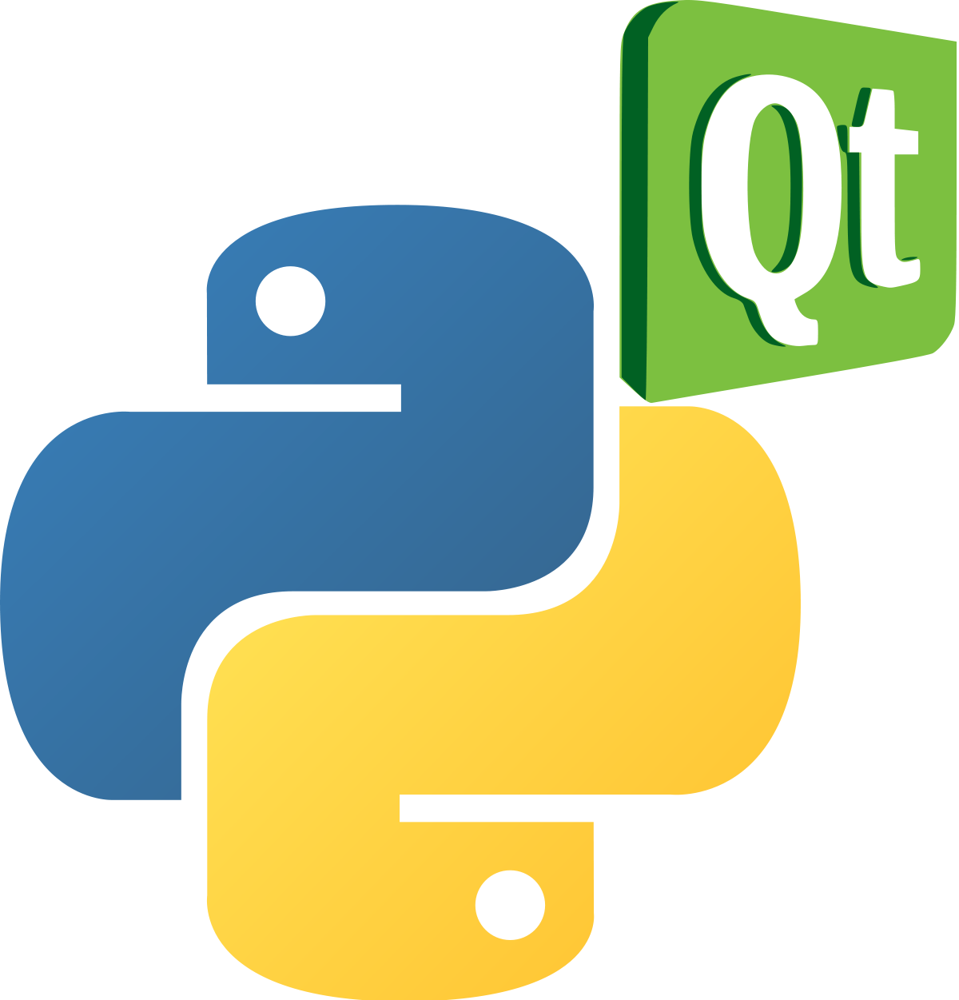

## Qt i PySide

**PySide** és la unió de Python amb el conjunt d'eines per a desenvolupament d'interfícies gràfiques d'usuari multiplataforma Qt, desenvolupat per *The Qt Company*, com a part del projecte [*Qt for Python*](https://doc.qt.io/qtforpython/). És una de les alternatives al paquet de biblioteca estàndard Tkinter. Igual que Qt, PySide és programari lliure. PySide és compatible amb Linux/X11, macOS i Microsoft Windows.

Tot i que hi ha documentació específica de PySide disponible, també podem **utilitzar la documentació de Qt**, tenint en compte que s'haurà de traduir la sintaxi d'objectes i mètodes per adaptar-ho a Python.

### Versions de PySide

Hi ha hagut tres versions principals de PySide:

- PySide és compatible amb Qt 4
- PySide2 és compatible amb Qt 5
- PySide6 és compatible amb Qt 6

La versió 1 de PySide va ser llançada l'agost de 2009 baix llicència LGPL per Nokia, aleshores propietaria de Qt, després de no arribar a un acord amb els desenvolupadors de PyQt, Riverbank Computing, per canviar els seus termes de llicència per incloure LGPL com a llicència alternativa. Va donar suport a Qt 4 sota els sistemes operatius Linux/X11, Mac OS X, Microsoft Windows, Maemo i MeeGo, mentre que la comunitat PySide va afegir suport per a Android.

Christian Tismer va iniciar PySide2 per portar PySide de Qt 4 a Qt 5 el 2015. Aleshores, el projecte es va incorporar al projecte Qt.Va ser llançat el desembre de 2018.

PySide6 es va llançar el desembre de 2020. Va afegir suport per a Qt 6 i va eliminar el suport per a totes les versions de Python anteriors a la 3.6.

El projecte va començar utilitzant Boost.Python de les biblioteques de Boost C++ per a enllaçar el codi Python amb les crides C++, llenguatge sobre el que està contruït Qt. Més tard va crear el seu propi generador d'enllaç anomenat Shiboken, per reduir la mida dels executables i l'ús de memòria.

Nosaltres farem ús de PySide6 durant el present curs.

### Instal·lació de PySide6

Sempre que desenvolupem, hauriem de fer-ho en un entorn virtual. Recordeu que per crear-lo i activar-lo, utilitzem:

```py
python3 -m venv .venv
source .venv/bin/activate #Per a Linux i macOS

env\Scripts\activate.bat #Per a Windows
```

Per a instal·lar PySide6 utilitzem **pip**:

```bash
pip install pyside6
```


### Comprovem la Instal·lació

Una vegada instal·lat i amb l'entorn virtual activat, podem executar el següent codi per comprovar que tot funciona.

```py
import PySide6.QtCore

# Prints PySide6 version
print(PySide6.__version__)

# Prints the Qt version used to compile PySide6
print(PySide6.QtCore.__version__)
```

## Primera aplicació amb PySide6 - *Hola món!*

### Exemple: Hola món! amb PySide6

```py
from PySide6 import QtWidgets, QtCore

# Sols si necessitem arguments importem sys
import sys


if __name__ == "__main__":
    # Necessitem una instància (i sols una) de QApplication per cada aplicació.
    # Li passem sys.argv per a permetre arguments des de la línia de comandaments
    # Si no anem a passar arguments podem utilitzar QApplication([])
    app = QtWidgets.QApplication(sys.argv)

    # Creem un QLabel amb el text Hola món! i aliniament al centre.
    label = QtWidgets.QLabel("Hola món!", alignment=QtCore.Qt.AlignCenter)
    # Redimensionem el QLabel
    label.resize(800, 600)
    #Fem visible el label IMPORTANT!!!!! Els components estan ocults per defecte.
    label.show()

    # Iniciem el bucle d’esdeveniments.
    sys.exit(app.exec())
```

> Si rebeu l'error *libOpenGL.so.0: cannot open shared object file: No such file or directory*, heu d'instal·lar la llibreria *libopengl0*.
> 
>  `sudo apt install libopengl0 -y`

Baixeu el codi [d'ací](../../resources/code/PySide6/Intro/hello.py)

### Què és una finestra?

- Conté la interfície de l’usuari
- Cada aplicació en necessita almenys una, però en pot tindre més
- L’aplicació, per defecte, acabarà en tancar l’última d’elles


### Què és el bucle d’esdeveniments (event loop)?

Ja hem vist que cada aplicació necessita un i sols un objecte QApplication. 

Aquest objecte gestiona els esdeveniments. Cada una de les interaccions de l’usuari amb la interfície, per exemple, un clic de ratolí sobre un element, genera un esdeveniment. 

L’esdeveniment es col·loca a la cola d’esdeveniments per ser gestionat (**event queue**).

Al bucle d'esdeveniments (**event loop**), la cua es comprova a cada iteració i si es troba un esdeveniment en espera, l'esdeveniment i el control es passen al gestor de l’esdeveniment (**event handler**).

El gestor d'esdeveniments s'ocupa de l'esdeveniment i després passa de nou el control al bucle d'esdeveniments per esperar més esdeveniments. 

Només hi ha un bucle d'esdeveniments per aplicació.

## QMainWindow
Es tracta d’un component pre-definit que proporciona moltes funcions estàndard de les finestres que fareu servir les vostres aplicacions, com poden ser les barres d'eines, els menús, la barra d'estat, els components que es poden acoblar, etc. Veurem aquestes funcions avançades més endavant, però de moment anem a fer ús d’ella a la nostra aplicació.

#### Activitat 1
Anem a crear la nostra primera aplicació.

1. Has de definir una classe MainWindow, que herede de QmainWindow.
2. Amb el mètode setWindowTitle() posa-li títol a l’aplicació «La meua aplicació». 
3. Amb QPushButton(), crea un botó amb el text, «Aceptar».
4. Afig el botó a la part central de la finestra amb setCentralWidget(«component»).
5. Recorda mostrar la finestra i iniciar el bucle d’esdeveniments.


#### Activitat 2
Modifica el codi de l’anterior activitat per a que es puga passar per línia de comandaments el títol i el text del botó.

```py
python3 activitat2.2.py "APP" "Text"
```


## Assignem tamany a les finestres i els components

Amb la funcions **.setFixedSize(amplada, altura)** assignem una mida fixa al component sobre el que l’apliquem. 

Amb **.setMinimumSize(amplada, altura)** i **setMaximumSize(amplada, altura)**, assignem les mides màximes i mínimes, de forma que ni redimensionant amb el ratolí ni amb els botons de maximitzar i minimitzar tindrem la possibilitat d’establir unes dimensions menors o majors de les establides.

```py
import sys

from PySide6.QtWidgets import QApplication, QMainWindow, QPushButton

class MainWindow(QMainWindow):
    def __init__(self, title="Title", button_text="Text", fixed=False):
        super().__init__()
        self.setWindowTitle(title)

        self.button = QPushButton(button_text)

        self.setCentralWidget(self.button)

        #self.setFixedSize(400,600)
        self.button.setMaximumSize(100,25)
        self.setMaximumSize(400,400)
        self.setMinimumSize(200,200)

        self.button.show()
        self.show()

app = QApplication(sys.argv)

window = MainWindow()

app.exec()

```
Baixa el codi punxant el següent [enllaç](../../resources/code/PySide6/Intro/main_window.py)

#### Activitat 3 (entregable)

Basant-nos en el codi de l'activitat 2, anem a fer una gestió més pràctica i real dels paràmetres d'entrada de l'script. Este és l'aspecte que tindrà l'ajuda de l'execució de l'script. 

```bash
usage: finestra3_args.py [-h] [-t TITLE] [-b BUTTON_TEXT] [-f] [-s SIZE SIZE]

optional arguments:
  -h, --help            show this help message and exit
  -t TITLE, --title TITLE
                        Title of application
  -b BUTTON_TEXT, --button-text BUTTON_TEXT
                        Button text
  -f, --fixed-size      Window fixed size
  -s SIZE SIZE, --size SIZE SIZE
                        Size of windows
```

Per a fer tota aquesta gestió, busca una llibreria de python que t'ajude.

