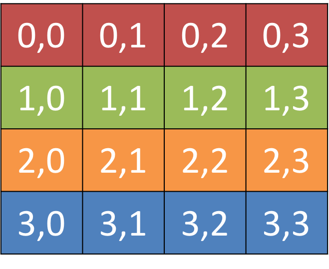
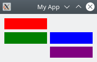
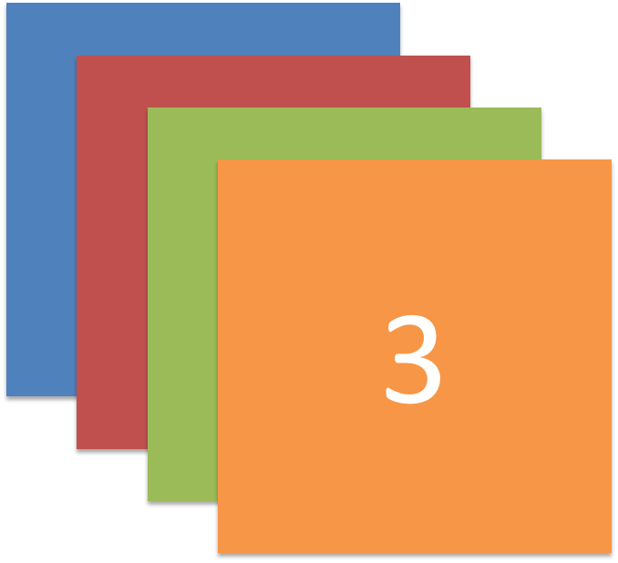
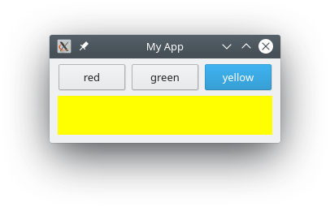
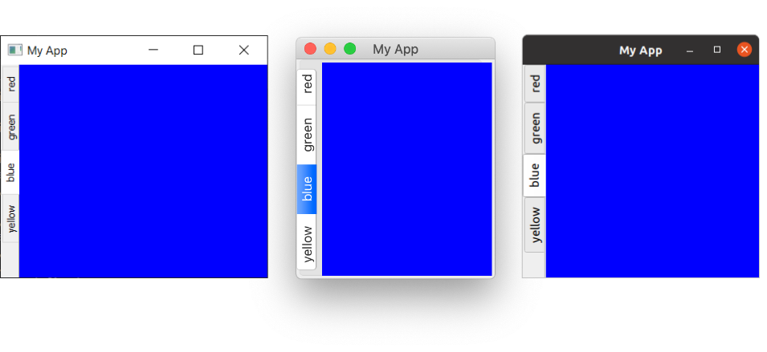
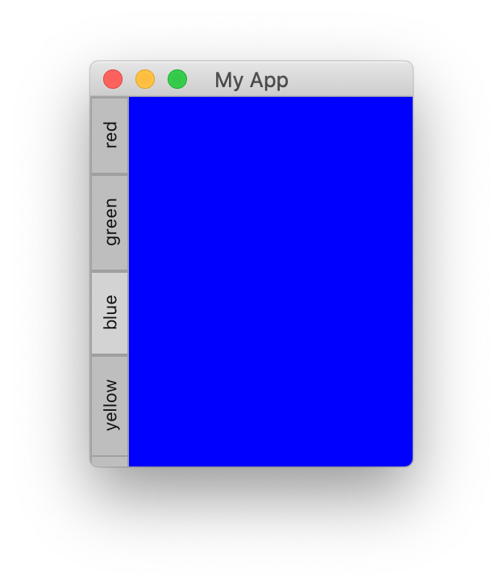

# Gestió del layout

Fins ara hem creat una finestra i hi hem afegit un *widget*. Tanmateix, normalment volem afegir més d'un *widget* a una finestra i tenir cert control sobre on va a parar. Per fer-ho a Qt fem servir *layouts*. Hi ha 4 dissenys bàsics disponibles a Qt, que s'enumeren a la taula següent.

| Layout         | Comportament                     |
| :------------- | :------------------------------- |
| QHBoxLayout    | Disseny horitzontal              |
| QVBoxLayout    | Disseny vertical                 |
| QGridLayout    | Disseny de graella indexable XxY |
| QStackedLayout | Apilats en profunditat           |

Com podeu veure, hi ha tres dissenys posicionals disponibles a Qt. El VBoxLayout, QHBoxLayout i QGridLayout. A més, també hi ha QStackedLayout que us permet col·locar *widgets* un damunt de l'altre dins del mateix espai, tot i que mostra només un *layout* alhora.


> Més endavant utilitzarem uns ferramenta gràfica per definir el *layout*.

## Classe Color

Per facilitar la visualització dels dissenys, primer crearem un *widget* personalitzat senzill que mostre un color sòlid que triem. Això ajudarà a distingir els *widgets* que afegim al disseny.

```python
from PySide6.QtGui import QPalette, QColor 
from PySide6.QtWidgets import QWidget


class Color(QWidget):

    def __init__(self, color):
        super(Color, self).__init__()
        self.setAutoFillBackground(True)

        palette = self.palette()
        palette.setColor(QPalette.Window, QColor(color))
        self.setPalette(palette)

```

En aquest codi subclassem QWidget per crear el nostre propi widget personalitzat Color. Acceptem un únic paràmetre a l'hora de crear un objecte Color: Color(un str). Primer establim .*setAutoFillBackground* a True per dir-li al *widget* que ompliga automàticament el seu fons amb el color que li hem passat. A continuació, obtenim la paleta actual (que és la paleta global de l'escriptori per defecte) i canviem el color *QPalette.Window* actual a un nou QColor descrit pel color del valor que hem passat. Finalment, tornem a aplicar aquesta paleta al *widget*. El resultat final és un *widget* que s'omple amb un color sòlid, què vam especificar quan el vam crear.

> Més endavant tractarem els *widget*s personalitzats amb més detall.

> Podeu establir l'espaiat al voltant del disseny amb `.setContentMargins` o establir l'espai entre elements amb `.setSpacing`.

## QVBoxLayout

El layout vertical va afegint els widgets un damunt de l'altre. Si afegim un nou *widget* l'afegirà a la part de baix.


```python
import sys
from PySide6.QtWidgets import QApplication, QMainWindow, QWidget, QVBoxLayout

from color_widget import Color

class MainWindow(QMainWindow):

    def __init__(self):
        super(MainWindow, self).__init__()

        self.setWindowTitle("My App")

        layout = QVBoxLayout()

        layout.addWidget(Color('red'))
        layout.addWidget(Color('green'))
        layout.addWidget(Color('blue'))

        widget = QWidget()
        widget.setLayout(layout)
        self.setCentralWidget(widget)


app = QApplication(sys.argv)

window = MainWindow()
window.show()

app.exec()
```

## QHBoxLayout

El *layout* horitzontal va afegint els components un al costat de l'altre. Si afegim un nou component, l'afegirà a l'esquerra.


```python
import sys
from PySide6.QtWidgets import QApplication, QMainWindow, QWidget, QHBoxLayout

from color_widget import Color


class MainWindow(QMainWindow):

    def __init__(self):
        super(MainWindow, self).__init__()

        self.setWindowTitle("My App")

        layout = QHBoxLayout()

        layout.addWidget(Color('red'))
        layout.addWidget(Color('green'))
        layout.addWidget(Color('blue'))

        widget = QWidget()
        widget.setLayout(layout)
        self.setCentralWidget(widget)


app = QApplication(sys.argv)

window = MainWindow()
window.show()

app.exec()
```

## Layouts *anidats*

Per a dissenys més complexos, podem niuar els dissenys els uns dintre dels altres mitjançant `.addLayout` en un disseny. A continuació, afegim un *QVBoxLayout* al *QHBoxLayout* principal. Si afegim alguns *widgets* al *QVBoxLayout*, estaran disposats verticalment a la primera ranura del disseny principal.

```python
import sys
from PySide6.QtWidgets import (
    QApplication, QMainWindow, QWidget, QHBoxLayout, QVBoxLayout
)

from color_widget import Color


class MainWindow(QMainWindow):

    def __init__(self):
        super(MainWindow, self).__init__()

        self.setWindowTitle("My App")

        layout1 = QHBoxLayout()
        layout2 = QVBoxLayout()
        layout3 = QVBoxLayout()

        layout1.setContentsMargins(0,0,0,0)
        layout1.setSpacing(0)

        layout2.addWidget(Color('red'))
        layout2.addWidget(Color('yellow'))
        layout2.addWidget(Color('purple'))

        layout1.addLayout(layout2)

        layout1.addWidget(Color('green'))

        layout3.addWidget(Color('red'))
        layout3.addWidget(Color('purple'))

        layout1.addLayout( layout3 )

        widget = QWidget()
        widget.setLayout(layout1)
        self.setCentralWidget(widget)


app = QApplication(sys.argv)

window = MainWindow()
window.show()

app.exec()
```

## QGridLayout

Per molt útils que siguen, si proveu d'utilitzar `QVBoxLayout` i `QHBoxLayout` per dissenyar diversos elements, per exemple a un formulari, us serà molt difícil assegurar-vos que els components de mida diferent s'alinein. La solució a això és `QGridLayout`.



QGridLayout us permet posicionar elements específicament en una quadrícula. Especifiqueu les posicions de fila i columna per a cada component. Podeu ometre elements i es deixaran buits.


```python
import sys
from PySide6.QtWidgets import QApplication, QMainWindow, QWidget, QGridLayout

from color_widget import Color 

class MainWindow(QMainWindow):

    def __init__(self):
        super(MainWindow, self).__init__()

        self.setWindowTitle("My App")

        layout = QGridLayout()

        layout.addWidget(Color('red'), 0, 0)
        layout.addWidget(Color('green'), 1, 0)
        layout.addWidget(Color('blue'), 1, 1)
        layout.addWidget(Color('purple'), 2, 1)

        widget = QWidget()
        widget.setLayout(layout)
        self.setCentralWidget(widget)

app = QApplication(sys.argv)

window = MainWindow()
window.show()

app.exec()
```



## QStackedLayout

El disseny final que tractarem és el QStackedLayout. Tal com es descriu, aquest disseny us permet col·locar elements directament els uns damunt dels altres (apilats). A continuació, podeu seleccionar quin disseny voleu mostrar. Podeu utilitzar-lo per dibuixar capes en una aplicació gràfica o per imitar una interfície semblant a una pestanya. Tingueu en compte que també hi ha `QStackedWidget`, que és un component de contenidor que funciona exactament de la mateixa manera. Això és útil si voleu afegir una pila de components directament a un *QMainWindow* amb *setCentralWidget*.



*QStackedWidget* és exactament com funcionen les vistes amb pestanyes a les aplicacions. Només una pestanya és visible alhora. Podeu controlar quin components mostrar en qualsevol moment utilitzant `.setCurrentIndex()` o `.setCurrentWidget()` per establir l'element mitjançant l'índex o per la referència al propi component.

A continuació es mostra una breu demostració amb *QStackedLayout* en combinació amb *QButton* per proporcionar una interfície semblant a una pestanya a una aplicació:

```python
import sys

from PySide6.QtCore import Qt
from PySide6.QtWidgets import (
    QApplication,
    QHBoxLayout,
    QLabel,
    QMainWindow,
    QPushButton,
    QStackedLayout,
    QVBoxLayout,
    QWidget,
)

from color_widget import Color


class MainWindow(QMainWindow):
    def __init__(self):
        super().__init__()

        self.setWindowTitle("My App")

        pagelayout = QVBoxLayout()
        button_layout = QHBoxLayout()
        self.stacklayout = QStackedLayout()

        pagelayout.addLayout(button_layout)
        pagelayout.addLayout(self.stacklayout)

        btn = QPushButton("red")
        btn.pressed.connect(self.activate_tab_1)
        button_layout.addWidget(btn)
        self.stacklayout.addWidget(Color("red"))

        btn = QPushButton("green")
        btn.pressed.connect(self.activate_tab_2)
        button_layout.addWidget(btn)
        self.stacklayout.addWidget(Color("green"))

        btn = QPushButton("yellow")
        btn.pressed.connect(self.activate_tab_3)
        button_layout.addWidget(btn)
        self.stacklayout.addWidget(Color("yellow"))

        widget = QWidget()
        widget.setLayout(pagelayout)
        self.setCentralWidget(widget)

    def activate_tab_1(self):
        self.stacklayout.setCurrentIndex(0)

    def activate_tab_2(self):
        self.stacklayout.setCurrentIndex(1)

    def activate_tab_3(self):
        self.stacklayout.setCurrentIndex(2)


app = QApplication(sys.argv)

window = MainWindow()
window.show()

app.exec()
```

El resultat és la següent aplicació:



### QTabWidget

Qt en realitat proporciona un TabWidget que proporciona aquest tipus de disseny en forma de widget. Vegeu el següent exemple amb QTabWidget:

```python
import sys

from PySide6.QtCore import Qt
from PySide6.QtWidgets import (
    QApplication,
    QLabel,
    QMainWindow,
    QPushButton,
    QTabWidget,
    QWidget,
)

from color_widget import Color


class MainWindow(QMainWindow):
    def __init__(self):
        super().__init__()

        self.setWindowTitle("My App")

        tabs = QTabWidget()
        tabs.setTabPosition(QTabWidget.West)
        tabs.setMovable(True)

        for n, color in enumerate(["red", "green", "blue", "yellow"]):
            tabs.addTab(Color(color), color)

        self.setCentralWidget(tabs)


app = QApplication(sys.argv)

window = MainWindow()
window.show()

app.exec()
```



Com podeu veure, és una mica més senzill i una mica més atractiu! Podeu establir la posició de les pestanyes mitjançant les direccions cardinals, canviar si les pestanyes es poden moure amb `.setMoveable`. Notareu que la barra de pestanyes de macOS té un aspecte molt diferent de les altres; de manera predeterminada, les pestanyes de macOS adopten un estil de pastilla o bombolla. A macOS, normalment s'utilitza per als panells de configuració amb pestanyes. Per als documents, podeu activar el mode de document per oferir pestanyes esveltes semblants a les que veieu a altres plataformes. Aquesta opció no té cap efecte en altres plataformes.

