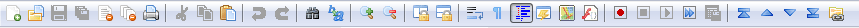

# Accions: barres de ferramentes i menús 

A continuació, veurem alguns dels elements comuns de la interfície d'usuari, que probablement heu vist en moltes altres aplicacions: barres d'eines i menús. Farem ús de *QAction* per a evitar duplicitat entre diferents parts de la interfície.

## Barres d'eines (*tool bar*)

Un dels elements de la interfície d'usuari més comuna és la barra de ferramentes. Són barres d'icones i/o text que s'utilitzen per realitzar tasques habituals dins d'una aplicació, per a les quals l'accés mitjançant un menú seria complicat. Són una de les funcions d'interfície d'usuari més comunes que es veuen en moltes aplicacions. Tot i que algunes aplicacions complexes, especialment a la suite de Microsoft Office, han migrat a interfícies de "menú" contextuals, la barra d'eines estàndard sol ser suficient per a la majoria d'aplicacions que creareu.



> Normalment es proporciona una interfície alternativa als menús per activar i desactivar les barres d'eines.

## QAction
QAction és una classe que proporciona una manera de descriure interfícies d'usuari abstractes. Això significa que podeu definir diversos elements d'interfície dins d'un únic objecte, unificats per l'efecte que té la interacció amb aquest element. Per exemple, és comú tindre funcions que es representen a la barra d'eines, però també al menú; penseu en alguna cosa com Edita->Retallar que està present tant al menú Edita com també a la barra d'eines com unes tisores, i també a través de la drecera de teclat Ctrl-X (Cmd-X a Mac).

Sense QAction hauríeu de definir-ho en diversos llocs. Però amb QAction podeu definir una única QAction, definint l'acció activada i després afegir aquesta acció tant al menú com a la barra d'eines. Cada QAction té noms, missatges d'estat, icones i senyals als quals us podeu subscriure.

Al codi següent podeu veure aquesta primera QAction a una barra de ferramentes.


### Exemple

```python
import sys
from PySide6.QtWidgets import (
    QMainWindow, QApplication,
    QLabel, QToolBar
)
from PySide6.QtGui import QAction
from PySide6.QtCore import Qt


class MainWindow(QMainWindow):

    def __init__(self):
        super(MainWindow, self).__init__()

        self.setWindowTitle("My Awesome App")

        label = QLabel("Hello!")
        label.setAlignment(Qt.AlignCenter)

        self.setCentralWidget(label)

        toolbar = QToolBar("My main toolbar")
        self.addToolBar(toolbar)

        button_action = QAction("Your button", self)
        button_action.triggered.connect(self.onMyToolBarButtonClick)
        toolbar.addAction(button_action)


    def onMyToolBarButtonClick(self, s):
        print("click", s)

app = QApplication(sys.argv)

window = MainWindow()
window.show()

app.exec()
```

Baixa el codi [ací](../../resources/code/PySide6/Actions-Toolbars-Menus/menu1.py)

## Barra d'estat (*status bar*)

En el següent exemple creem una barra d'estat i l'afegim a la finestra principal. En passar el ratolí per damunt el botó de la barra d'estat, es mostra el text definit a la barra d'estats.

#### Exemple

```python
import sys
import os

from PySide6.QtWidgets import (
    QMainWindow, QApplication,
    QLabel, QToolBar, QStatusBar
)
from PySide6.QtGui import QAction, QIcon
from PySide6.QtCore import Qt, QSize


class MainWindow(QMainWindow):

    def __init__(self):
        super(MainWindow, self).__init__()

        self.setWindowTitle("My Awesome App")

        label = QLabel("Hello!")
        label.setAlignment(Qt.AlignCenter)

        self.setCentralWidget(label)

        toolbar = QToolBar("My main toolbar")
        self.addToolBar(toolbar)

        icon_path = os.path.join(os.path.dirname(__file__), "img/animal-penguin.png")

        button_action = QAction(QIcon(icon_path), "Your button", self)
        button_action.setStatusTip("This is your button")
        button_action.triggered.connect(self.onMyToolBarButtonClick)
        button_action.setCheckable(True)
        toolbar.addAction(button_action)

        self.setStatusBar(QStatusBar(self))


    def onMyToolBarButtonClick(self, s):
        print("click", s)

app = QApplication(sys.argv)

window = MainWindow()
window.show()

app.exec()
```

Podem configurar l'action per a transformar el botó en un polsador. A més, també podem afegir una icona i configurar la posició del text que acompanya a aquesta icona segons els valors de la taula següents:

| Flag                        | Comportament                                      |
| :-------------------------- | :------------------------------------------------ |
| Qt.ToolButtonIconOnly       | Icona sola, sense text                            |
| Qt.ToolButtonTextOnly       | Text sol, sense icona                             |
| Qt.ToolButtonTextBesideIcon | Icona i text, amb el text al costat de la icona   |
| Qt.ToolButtonTextUnderIcon  | Icona i text, amb el text baix de la icona        |
| Qt.ToolButtonFollowStyle    | Seguir l'estil de la configuració de l'escriptori |

El valor predeterminat és Qt.ToolButtonFollowStyle, el que significa que la vostra aplicació seguirà per defecte la configuració estàndard/global per a l'escriptori on s'executa l'aplicació. Això es recomana generalment perquè la vostra aplicació s'integre millor i es senta el més nativa possible.

Finalment, afegirem un segon botó i un *checkbox* a la barra de ferramentes. Podeu posar qualsevol component.

> Podeu accedir a icones publicades baic CC al següent [enllaç](http://p.yusukekamiyamane.com/)

## Menús

Els menús són un altre component estàndard de les interfícies d'usuari. Normalment es troben a la part superior de la finestra o a la part superior d'una pantalla a macOS. Permeten l'accés a totes les funcions estàndard de l'aplicació. Hi ha uns quants menús estàndard, per exemple Fitxer, Edita, Ajuda. Els menús es poden *anidar* per crear arbres jeràrquics de funcions i sovint admeten i mostren dreceres de teclat per accedir ràpidament a les seves funcions.

Per crear un menú, creem una barra de menús que anomenem **.menuBar()** a QMainWindow. Afegim un menú a la nostra barra de menús cridant a **.addMenu()**, passant el nom del menú. En este cas l'hem anomenat "&Fitxer". El ampersand defineix una tecla ràpida per mostrar aquest menú en prémer Alt.